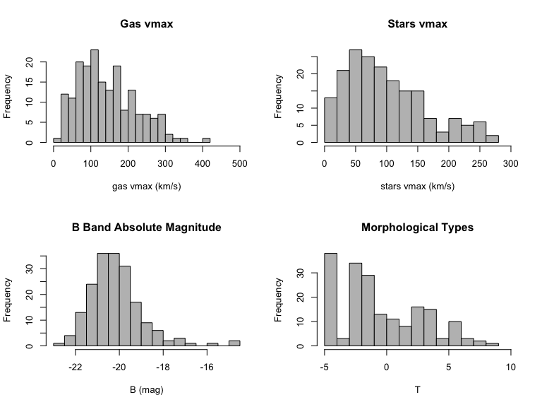
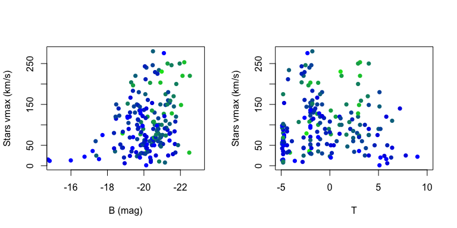
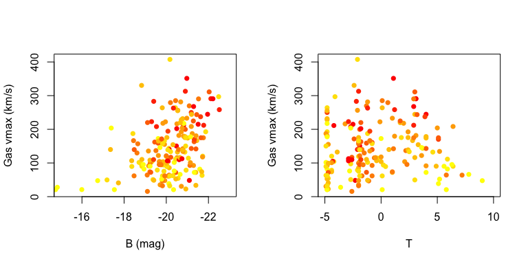
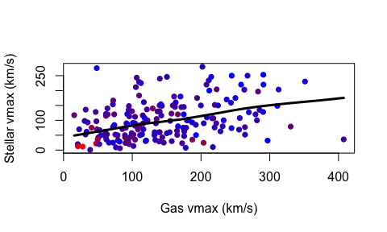

Stellar and gas rotation velocities of galaxies from HyperLeda
================

------------------------------------------------------------------------

------------------------------------------------------------------------

##### Using  for investigating the statistical relation between galaxies gas and stellar maximum rotation velocities, morphological types, and B band absolute magnitudes.

------------------------------------------------------------------------

### The Data

From the HyperLeda database (<http://leda.univ-lyon1.fr>) I get all the galaxies for which all of these four quantities have been measured using the following SQL command:

SELECT

mabs, vmaxs, vmaxg, t

WHERE

objtype='G' and vmaxs IS NOT NULL and t IS NOT NULL and vmaxg IS NOT NULL and mabs IS NOT NULL and vmaxs != 0 and vmaxg != 0

Note that I intentionally excluded galaxies with zero rotation velocity, because that value cannot be physically correct.

------------------------------------------------------------------------

#### Loading the data:

I have downloaded a comma separated csv file from HyperLeda which can be loaded in  via:

``` r
data=read.csv("HyperLeda_data.txt", header=TRUE, sep=',')
```

------------------------------------------------------------------------

### The Distributions:

The histograms of the four measured quantities can be checked using  hist() function:

``` r
par(mfrow=c(2,2))

with(data,hist(vmaxg, breaks=15, main='Gas vmax', col='grey', xlim = c(0,500), xlab = 'gas vmax (km/s)'))

with(data,hist(vmaxs, breaks=15, main='Stars vmax', col='grey', xlim = c(0,300), xlab = 'stars vmax (km/s)'))

with(data,hist(mabs, breaks=15, main='B Band Absolute Magnitude', col='grey', xlab = 'B (mag)'))

with(data,hist(t, breaks=15, main='Morphological Types', col='grey', xlim = c(-5,10), xlab = 'T'))
```



The faintest galaxy has an absolute B magnitude of around -15 mag and the distribution peaks around -21 mag.

The morphological types are based on de Vaucouleurs classification. Further information can be found here: <http://leda.univ-lyon1.fr/leda/param/t.html>

------------------------------------------------------------------------

### Stellar maximum rotation velocity:

Let's look at the stellar vmax vs. absolute B mag and morphological type T using  plot() function:

``` r
par(mfrow=c(1,2))

rbPal <- colorRampPalette(c('blue','green'))
data$Col <- rbPal(10)[as.numeric(cut(data$vmaxg,breaks = 10))]

with(data,plot(mabs, vmaxs, col=data$Col, xlim = c(-15,-23), cex=1, pch=16, xlab = 'B (mag)', ylab = 'Stars vmax (km/s)'))

with(data,plot(t, vmaxs, col=data$Col, xlim = c(-5,10), cex=1, pch=16, xlab = 'T', ylab = 'Stars vmax (km/s)'))
```

 In this figure, the color of the points are the gas vmax increasing from blue to green.

A general trend, though with large scatter, can be seen in the left panel of the figure above with brighter galaxies (smaller magnitudes) having larger stellar vmax. However, in this particular sample, there seems to be no significant relation between stellar vmax and the galaxies morphological types, which requires further investigations.

##### Quantify the correlations:

Using cor() and cor.test() functions in  we can check the correlations between stellar vmax and B and T:

``` r
cor.test(data$vmaxs, data$mabs, method=c("pearson"))
```

    ## 
    ##  Pearson's product-moment correlation
    ## 
    ## data:  data$vmaxs and data$mabs
    ## t = -4.2979, df = 184, p-value = 2.791e-05
    ## alternative hypothesis: true correlation is not equal to 0
    ## 95 percent confidence interval:
    ##  -0.4273549 -0.1653544
    ## sample estimates:
    ##        cor 
    ## -0.3020477

``` r
cor.test(data$vmaxs, data$t, method=c("pearson"))
```

    ## 
    ##  Pearson's product-moment correlation
    ## 
    ## data:  data$vmaxs and data$t
    ## t = -0.15737, df = 184, p-value = 0.8751
    ## alternative hypothesis: true correlation is not equal to 0
    ## 95 percent confidence interval:
    ##  -0.1552210  0.1324998
    ## sample estimates:
    ##         cor 
    ## -0.01160073

We can see that while the correlation coefficient between stellar vmax and B mag is not large, the p-value shows that it is a relatively significant correlation. However, both the correlation coefficient and p-value indicate no correlation between stellar vmax and T.

------------------------------------------------------------------------

### Gas maximum rotation velocity:

``` r
par(mfrow=c(1,2))

rbPal <- colorRampPalette(c('yellow','red'))
data$Col <- rbPal(10)[as.numeric(cut(data$vmaxs,breaks = 10))]

with(data,plot(mabs, vmaxg, col=data$Col, xlim = c(-15,-23), cex=1, pch=16, xlab = 'B (mag)', ylab = 'Gas vmax (km/s)'))

with(data,plot(t, vmaxg, col=data$Col, cex=1, xlim = c(-5,10), pch=16, xlab = 'T', ylab = 'Gas vmax (km/s)'))
```

 Similar to the previous figure, the gas vmax is plotted vs. absolute B mag and morphological type T. Here, the color of the points are the stellar vmax increasing from yellow to red.

As expected, the trend in gas vmax vs. B mag is similar to that of stellar vmax.

##### Quantifying the correlation between gas vmax and B and T:

``` r
cor.test(data$vmaxg, data$mabs, method=c("pearson"))
```

    ## 
    ##  Pearson's product-moment correlation
    ## 
    ## data:  data$vmaxg and data$mabs
    ## t = -5.8379, df = 184, p-value = 2.348e-08
    ## alternative hypothesis: true correlation is not equal to 0
    ## 95 percent confidence interval:
    ##  -0.5101789 -0.2666019
    ## sample estimates:
    ##        cor 
    ## -0.3953175

``` r
cor.test(data$vmaxg, data$t, method=c("pearson"))
```

    ## 
    ##  Pearson's product-moment correlation
    ## 
    ## data:  data$vmaxg and data$t
    ## t = 0.9712, df = 184, p-value = 0.3327
    ## alternative hypothesis: true correlation is not equal to 0
    ## 95 percent confidence interval:
    ##  -0.07321672  0.21310463
    ## sample estimates:
    ##        cor 
    ## 0.07141495

The correlation between gas vmax and B mag is relatively significant (though not strong), and there is no significant correlation between gas vmax and T.

------------------------------------------------------------------------

### Stellar vs. Gas rotation velocities

We can also investigate the statistical relation between stellar and gas vmax:

``` r
rbPal <- colorRampPalette(c('blue','red'))
data$Col <- rbPal(10)[as.numeric(cut(data$mabs,breaks = 10))]

with(data,scatter.smooth(vmaxg, vmaxs, col=data$Col, cex=1, pch=16, xlab = 'Gas vmax (km/s)', ylab = 'Stellar vmax (km/s)', lpars =list(col = "black", lwd = 3)))
```



``` r
cor.test(data$vmaxs, data$vmaxg, method=c("pearson"))
```

    ## 
    ##  Pearson's product-moment correlation
    ## 
    ## data:  data$vmaxs and data$vmaxg
    ## t = 5.3813, df = 184, p-value = 2.231e-07
    ## alternative hypothesis: true correlation is not equal to 0
    ## 95 percent confidence interval:
    ##  0.2374783 0.4868088
    ## sample estimates:
    ##       cor 
    ## 0.3687579

The figure above shows stellar vmax vs. gas vmax. The color is the B magnitude with luminosity increasing from red to blue. The fitted line, given by scatter.smooth() in  shows the general trend. There is a weak, but significant, correlation between the stellar and gas maximum rotation velocities, as expected.
